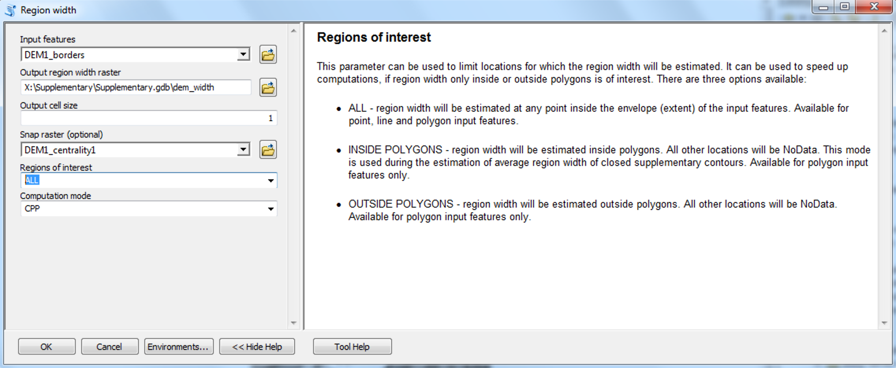

   

# Supplementary contours

**Supplementary contour lines** are placed between regular contour lines to visualize small but important terrain forms that regular contour lines are unable to show. On topographic maps, typical forms are hillcrests, depressions, saddles, terraces, banks, and levees.

*Contour types drawn by Eduard Imhof (Cartographic Relief Presentation, 1982):*

**supplementary-contours** ArcGIS Python toolbox provides the complete set of tools for generation of supplementary, regular and index contours.

## Requirements

You need **ArcGIS Pro** (Python 3.6) or **ArcGIS for Desktop 10.3+** (Python 2.7) with *Spatial Analyst* extension module to use the toolbox.

## Installation

Download the latest [release](https://github.com/tsamsonov/supplementary-contours/releases) and extract the contents of ZIP archive. You should see `supplementary-contours.pyt` Python toolbox in the *Catalog* window pane of **ArcGIS Pro** or **ArcMap**:

## Usage

You can use this software for free. Six tools are contained in the toolbox:

1. **Centrality** tool calculates the centrality raster field. The value of each pixel of this raster provides estimation of how close it is located to the central line of the region between contours. Central pixels have *C = 1*,
pixels under the regular contours have *C = 0*.

2. **Region borders** tool subdivides the space into the set of regions formed by regular contours and the boundary of interpolation area. Edges between the resulting regions are returned as a result.

3. **Region width** tool calculates the region width raster field. The value of each pixel of this raster provides estimation of local width of the region. It is modeled using the circle-based approach: the width is equal to the diameter of a largest circle covering the center of the pixel and located completely within the current region.

4. **Supplementary contours** tool takes width, centrality and elevation rasters and produces supplementary contours guided by the set of constraints.

5. **Supplementary contours (full)** tool works similarly to the previous one, but does not require width and centrality rasters as input parameters. *It is the main tool of the toolbox which combines all stages of supplementary contours placement.*

6. **Width-centrality mask** tool combines width and centrality rasters and produces the raster which masks the suitable areas for supplementary contours generation.

> A good starting point is **Supplementary contours (full)** tool, which combines all stages of processing. Just read its help, fill the empty parameters, leave others by default and launch the processing. All other tools are supplementary ;) and can be used to get intermediate features and surfaces used in processing, if needed.

## Visualization

To visualize the resulting contours you need to do two things:

1. Set the appropriate symbology based on the *Type* field:

    

2. Set definition query to `Show = 1`. This query hides the segments of supplementary contours which were filtered out during processing:

    

This is how it looks for the fragment of `DEM1`:

## Help

A brief description of each tool can be found in the Tool Help panel:

To get help about a parameter of the tool, place the cursor inside that parameter (highlighted in blue):

To switch from the help of the specific parameter to the general tool help, just click somewhere outside the parameter.

## Example data

Eight example digital elevation models in GeoTIFF format are available from the `data` folder. You can use these models to get familiar with functionality of the toolbox. These models were used during development of the method, and also in the paper cited below.

## Acknowledgements

[pybind11](https://github.com/pybind/pybind11/) library is used to compile region width estimation module. Writing C++ extensions for Python was never so easy and enjoyable.

The authors thank [Bernhard Jenny](http://berniejenny.info/) and [Sergey Koshel](https://istina.msu.ru/profile/skoshel/) for their invaluable comments that helped to improve the methodology and software.

## Further reading

A detailed description of the method can be found in this paper:

*Samsonov T., Koshel S, Walther D., Jenny B.* [Automated placement of supplementary contour lines](https://www.researchgate.net/publication/332963490_Automated_placement_of_supplementary_contour_lines) // **International Journal of Geographical Information Science**. — 2019. — Vol. 33. — DOI: 10.1080/13658816.2019.1610965.

## Citation & Copyright

To cite the software use the following reference:

*Samsonov, T. and Walther, D.*, 2019. Supplementary contours: ArcGIS Python toolbox for automated
placement of supplementary contour lines. **Zenodo**. DOI:[10.5281/zenodo.1346066](https://doi.org/10.5281/zenodo.1346066)

© 2017-2019, Timofey Samsonov & Dmitry Walther, Lomonosov MSU Faculty of Geography.
